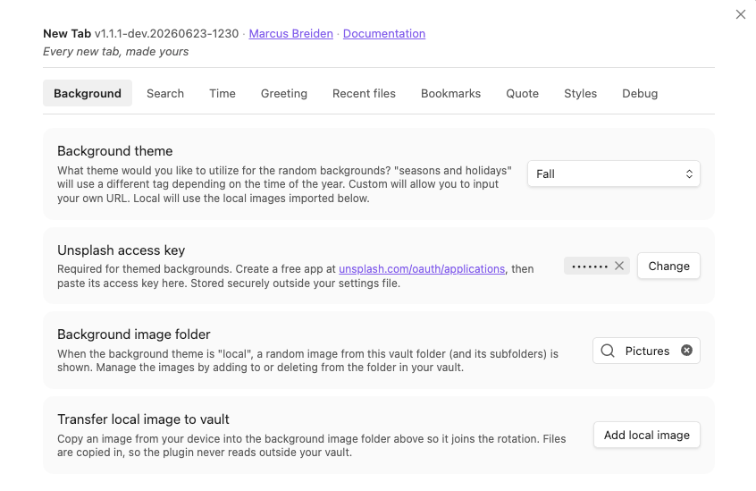
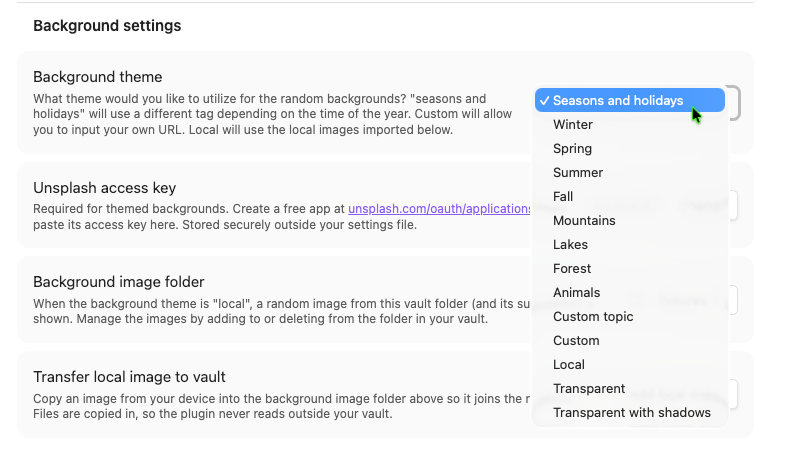
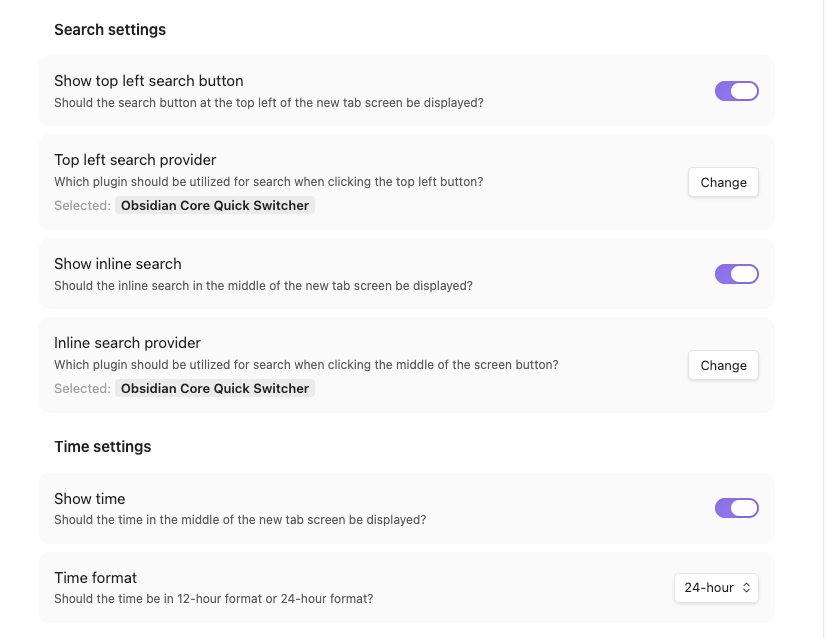
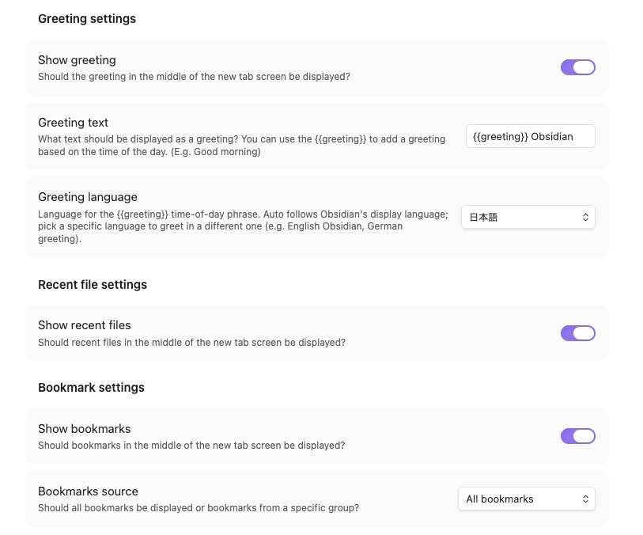
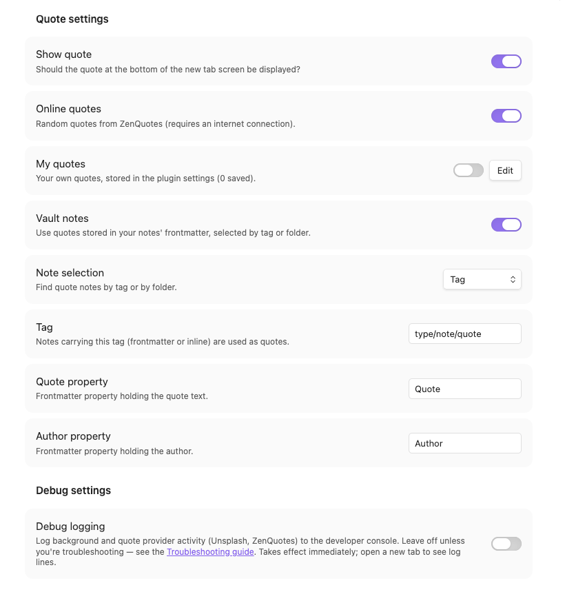

# Configuration

All settings for New Tab live in one place and apply immediately as you change
them.

## How to open settings

Open **Settings → Community plugins → New Tab** (gear icon), or **Settings → New
tab** in the left settings sidebar. Changes take effect at once — open a new tab
to see them.

## Settings reference

Some rows are **conditional** — they only appear in the settings panel when a
related option is selected (noted in the description).

### Background

  

| Setting | Default | Description |
|---|---|---|
| Background theme | `Seasons and holidays` | Theme for the random background. **Seasons and holidays** varies by time of year; the fixed subjects **Winter, Spring, Summer, Fall, Mountains, Lakes, Forest, Animals** each always pull that subject; **Custom topic** uses your own search term; **Custom** lets you supply a URL; **Local** uses imported images; **Transparent** and **Transparent with shadows** show your Obsidian theme. The first ten (Seasons and holidays, the eight fixed subjects, and Custom topic) are Unsplash-backed and need an access key. |
| Unsplash access key | _(unset)_ | Required for the Unsplash-backed themes. Create a free app at [unsplash.com/oauth/applications](https://unsplash.com/oauth/applications) and paste its access key. Stored securely outside `data.json`. Shown only for Unsplash-backed themes. |
| Custom topic | `""` | Search term(s) used to pick a random Unsplash photo, e.g. "ocean sunset". Shown only when the theme is "Custom topic". |
| Custom background URL | `""` | The URL to use for the background image. Shown only when the theme is "Custom". |
| Background image folder | `""` | When the theme is "Local", a random image from this vault folder (and subfolders) is shown. |

> The **Transfer local image to vault** button (Background section) copies an
> image from your device into the background folder so it joins the rotation —
> it is an action, not a stored setting.

  

### Search

  

| Setting | Default | Description |
|---|---|---|
| Show top left search button | `true` | Show the search button at the top-left of the new tab. |
| Top left search provider | `Obsidian Core Quick Switcher` | Which plugin handles search from the top-left button. Supports the core Quick Switcher, Omnisearch, Switcher++, and Another Quick Switcher. |
| Show inline search | `true` | Show the inline search box in the middle of the new tab. |
| Inline search provider | `Obsidian Core Quick Switcher` | Which plugin handles search from the inline box. |

### Time

| Setting | Default | Description |
|---|---|---|
| Show time | `true` | Show the clock in the middle of the new tab. |
| Time format | `12-hour` | Display the time in 12-hour or 24-hour format. |

### Greeting

  

| Setting | Default | Description |
|---|---|---|
| Show greeting | `true` | Show the greeting in the middle of the new tab. |
| Greeting text | `Hello, Beautiful.` | The greeting text. Use the `{{greeting}}` token to insert a time-of-day greeting (e.g. "Good morning"). |
| Greeting language | `Auto (follow Obsidian)` | Language for the `{{greeting}}` phrase. "Auto" follows Obsidian's display language; pick a specific language to greet in a different one. |

### Recent files

| Setting | Default | Description |
|---|---|---|
| Show recent files | `true` | Show recently opened files in the middle of the new tab. |

### Bookmarks

| Setting | Default | Description |
|---|---|---|
| Show bookmarks | `false` | Show bookmarks in the middle of the new tab. |
| Bookmarks source | `All bookmarks` | Show all bookmarks, or only those from a specific group. |
| Bookmarks group | `""` | Which bookmark group to pull from. Shown only when the source is "Bookmarks from group". |

### Quote

  

| Setting | Default | Description |
|---|---|---|
| Show quote | `true` | Show the quote at the bottom of the new tab. |
| Online quotes | `true` | Random quotes from ZenQuotes (requires an internet connection). |
| My quotes | `false` | Your own quotes, stored in the plugin settings (edited via the "Edit" button). |
| Vault notes | `false` | Use quotes stored in your notes' frontmatter, selected by tag or folder. |
| Note selection | `Tag` | Find quote notes by tag or by folder. Shown only when "Vault notes" is on. |
| Tag | `type/note/quote` | Notes carrying this tag (frontmatter or inline) are used as quotes. Shown only in tag mode. |
| Folder | `""` | Notes in this folder and its subfolders are used as quotes. Shown only in folder mode. |
| Quote property | `Quote` | Frontmatter property holding the quote text. Shown in vault-notes mode. |
| Author property | `Author` | Frontmatter property holding the author. Shown in vault-notes mode. |

> Quotes are drawn from the **union** of whichever sources are enabled. If a
> source fails (e.g. offline ZenQuotes), the plugin falls back to the others.

### Debug

| Setting | Default | Description |
|---|---|---|
| Debug logging | `false` | Log background and quote provider activity to the developer console. Leave off unless troubleshooting — see [Troubleshooting](troubleshooting.md). Takes effect immediately. |

## Tips

- For a fully **offline** new tab, set the background theme to **Local**,
  **Custom** (URL), or **Transparent**, and set the quote source to **My
  quotes** — neither needs network access or an Unsplash key.
- The search and quote providers reuse plugins you already have installed; New
  Tab does not bundle its own search index.
