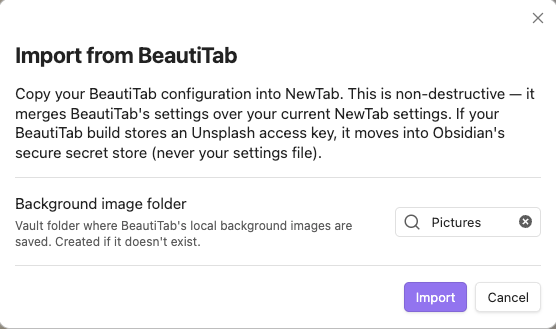
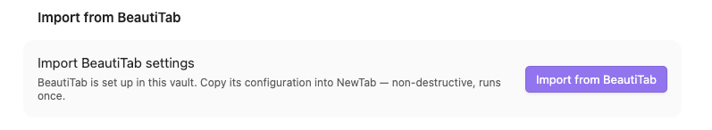
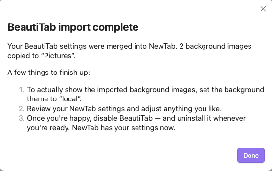

# Migrating from BeautiTab

NewTab is derived from [BeautiTab](https://github.com/andrewmcgivery/obsidian-beautitab),
so it can import your existing BeautiTab configuration in one click instead of
making you reconfigure everything by hand.

  

## How it works

- **Opt-in, never silent.** NewTab does *not* read or copy BeautiTab's settings
  automatically. It only acts when you explicitly confirm the import.
- **Offered once.** On the first load after NewTab detects a BeautiTab
  `data.json` in your vault, it opens a one-time import dialog. Whether you import
  or dismiss it, the dialog won't pop up again on its own.
- **Always reachable.** If you dismiss the popup, an **Import from BeautiTab**
  button stays at the top of the NewTab settings tab for as long as BeautiTab is
  present and you haven't imported yet. Use it whenever you're ready.
- **Non-destructive.** The import *merges* BeautiTab's values over your current
  NewTab settings — it never wipes settings you've already changed, and you can
  keep adjusting everything afterwards.

  

Both the original BeautiTab and the maintained fork are supported (they share the
same plugin id and settings file), so the import works regardless of which build
you run.

## What carries over

- Background theme and custom background URL.
- Local background images — BeautiTab stores these inline; NewTab writes them out
  as real image files into a vault folder you choose during the import, then
  points the **Local** background mode at that folder.
- Clock visibility and 12-/24-hour format.
- Greeting visibility and text.
- Top-left and inline search visibility and providers.
- Recent files and bookmarks visibility, plus the bookmark source/group.
- Quote visibility and your custom quotes.
- Quote source: BeautiTab's "Quoteable" maps to NewTab's online quotes; "My
  quotes" and "Both" map to the matching toggles.
- **Unsplash access key** — only some BeautiTab builds store one. When present,
  it's moved into Obsidian's secure secret store (never written to NewTab's
  settings file).

## What doesn't carry over

- NewTab-only features that BeautiTab has no equivalent for keep their defaults:
  the custom-topic background, greeting language, and **vault-note quotes** (using
  notes in your vault as a quote source — configure these in NewTab settings).
- BeautiTab's transient background cache is ignored.

## After importing

  

When the import finishes, NewTab shows a short checklist. The things worth doing:

1. **Unsplash key (if needed).** If the imported background theme uses Unsplash
   but no key came across (the original BeautiTab doesn't store one), add your own
   access key under **NewTab settings → Background settings**. The link to create a
   free key is right there in the setting.
2. **Local images (if any).** Imported background images are saved as files in the
   vault folder you chose. To actually display them, set the background theme to
   **Local**.
3. **Review.** Open the NewTab settings tab and adjust anything you like — the
   import is a starting point, not the last word.
4. **Retire BeautiTab.** Once you're happy, disable BeautiTab. You can uninstall it
   whenever you're ready; NewTab has your settings now.
