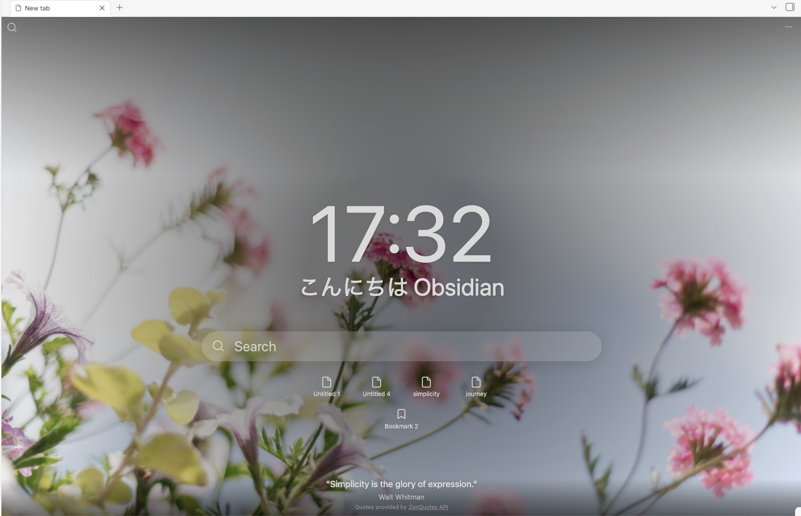

# Usage

Get from an installed plugin to a working new tab, then the workflows you'll repeat.

## First use

  

Open a new tab (**Ctrl/Cmd + T**, or click the **+** in the tab bar). The empty
tab is replaced by the New Tab view. With the default settings it shows:

- a full-screen **background** image,
- a **clock** and a **greeting** ("Hello, Beautiful."),
- a **search** box and a top-left search button,
- your **recent files**, and
- a **quote**.

Nothing else is required to start. One caveat: the default background theme
(*Seasons and holidays*) pulls from Unsplash, so it needs a free access key —
see [Configuration](configuration.md). Until a key is set, switch the background
to **Local**, **Custom** (a URL), or **Transparent** for a fully offline new
tab.

## Common workflows

- **Search your vault.** Click the search box (or the top-left search button)
  and type. It opens your chosen switcher — the **Obsidian Quick Switcher** by
  default, or **Omnisearch**, **Switcher++**, or **Another Quick Switcher** if
  you have them installed and selected in settings.
- **Open a recent file.** Click any entry in the recent-files list.
- **Create a note from a new tab.** Press **Ctrl/Cmd + N** (or run *Create new
  note*) while a New Tab is focused — the new note opens *in that tab* instead
  of beside it.
- **Show your bookmarks.** Bookmarks are off by default; enable them in settings
  to list either all bookmarks or a single bookmark group on the new tab.
- **Read a fresh quote.** A quote appears each time the view loads, and then
  rotates together with the background image at the top of each hour. By default
  it comes from an online source; you can instead use your own custom quotes or
  quotes pulled from vault notes.

## Tips and shortcuts

- **Ctrl/Cmd + T** — open a new tab, which becomes the New Tab view.
- **Ctrl/Cmd + N** from a New Tab — turn that tab into a brand-new note.
- **Just start typing** in the inline search box — the first keystroke is
  forwarded into the switcher, so you don't lose it.
- Toggle any widget — clock, greeting, recent files, bookmarks, quote — on or
  off independently in **Settings → New tab**.

## Examples

The default layout is shown in [First use](#first-use) above.

<!-- TODO: add a screenshot of an offline/transparent background variant (Local
or Transparent theme) to complement the default Unsplash background above. -->
